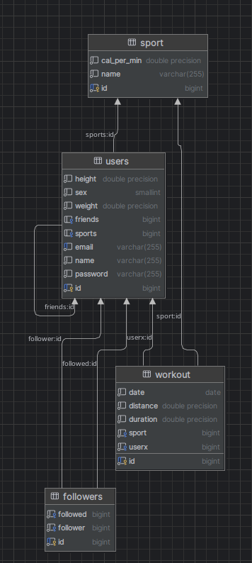

# Rapport Exam Grégoire Launay--Bécue

Je n'ais pas eu le temps de faire certaine implémentation, notament certain post & update, mais la structure backend est la. pas eu le temps nonplus de faire la methéo

## Installation

docker compose up -d
maven install

## Diagram de relation

## Endpoints

`[GET] /user/profile` : permet d'afficher le profil de l'utilisateur connecter
`[GET] /user/workout` : permet de récupérer les activité d'un utilisateur
`[GET] /user/login` : permet de se connecter
`[GET] /user/logout` : permet de ce déconnecter
`[POST] /user/profile` : permet de créer le compte

Pas eu le temps d'implémenter
`[POST] /user/:userID/friends` : demande d'ami
`[DELETE] /user/:userID/friends` : supression ami
`[GET] /user/:userID/workout` : voir le workout d'un ami
`[GET] /user/:userID/profile` : voir le profile
`[GET] /metheo/:ville` : voir la méthéo d'une ville

## Class

Utilisateur
-> sexe: enum
-> age: int
-> taille: int
-> poids: double

Sport
-> nom: String

Workout
-> durrée (s): double # car certain sport doivent être précis ex ski, natation
-> distance (m): double
-> calculCalori()

Follower
->

# Site de suivi sportif

Les features principales de l’application incluent (mais ne sont pas limitées à) :
  - L’utilisateur peut se créer (et modifier) un profil sur le site avec ses préférences en
termes de sport, son niveau de pratique, ses informations personnelles (sexe, âge,
taille, poids…) et ses objectifs personnels (par ex. « courir 50 km par mois » … )
  - L’utilisateur pourra enregistrer des activités avec le type de sport, la date, la durée, la
distance et une évaluation.
  - Pour chaque activité, les calories consommées seront automatiquement calculées.
De plus, les conditions météo seront automatiquement récupérées depuis une API
externe et gratuite (par exemple open-météo…).
  - Dashboard personnel, afin de visualiser toutes ses activités, ses progrès au cours du
temps, ses performances par rapport à ses objectifs (sous forme d’indicateurs ou de
courbes).
  - Chaque utilisateur pourra rechercher un autre utilisateur et devenir ami avec lui/elle.
Il aura ainsi un ensemble d’amis, dont il pourra voir les activités.
  - Chaque utilisateur pourra rechercher un autre utilisateur et devenir ami avec lui/elle.
Il aura ainsi un ensemble d’amis, dont il pourra voir les activités.
  - Challenges : un utilisateur pourra créer ou rejoindre des challenges (par ex. «
réaliser le plus de pompes possibles par jour », « courir le plus longtemps dans une
semaine » …). Un challenge aura une durée de validité. Pour chaque challenge, le
classement des différents participants pourra être affiché.
  - Badges : à chaque accomplissement, l’utilisateur pourra gagner des badges (par ex.
Premier 5km, 10km, 21km, 42km … de course …), qui seront affichés avec son
profil.
  - Commentaires et réactions. Un utilisateur pourra réagir aux activités de ses amis au
moyen d’un commentaire ou d’une réaction (kudos).

# Les technos utilisées

Backend :
  - Spring boot (Java)
      - Thymeleaf (Front)
      - Spring web
      - JPA
      - Spring dev-tools
      - Spring boot security

Frontend :
  - Thymeleaf
  - Daisy UI
