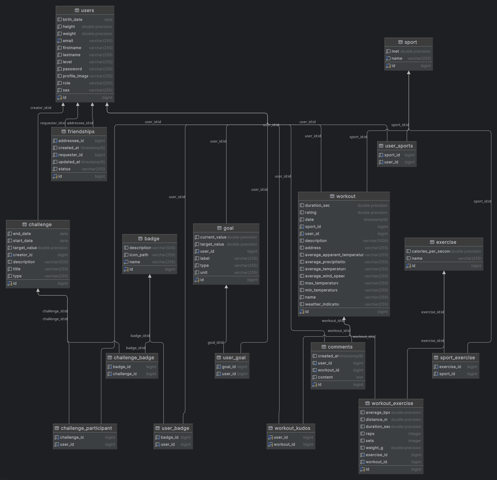
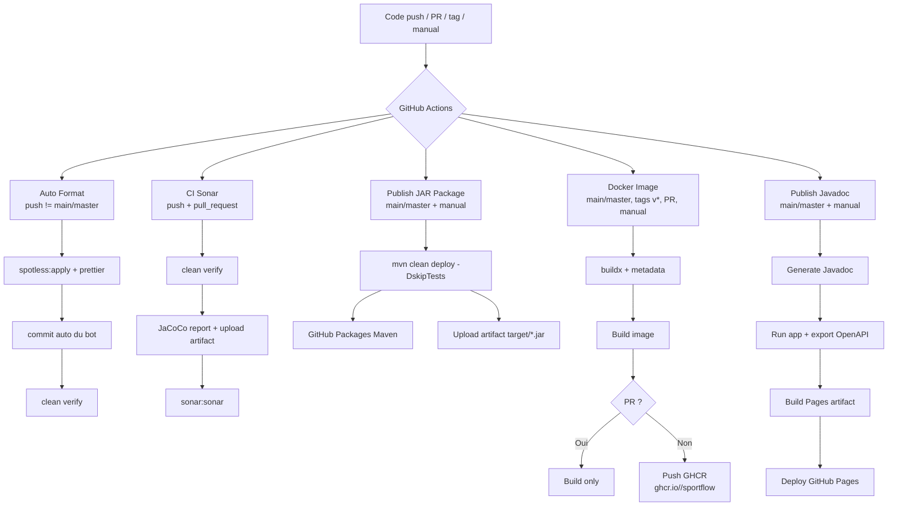

# m1-s2-web-projet

## Links

- [Sport Flow](https://sportflow.linv.dev)
- [JavaDoc](https://linventif.github.io/m1-s2-web-projet/java-docs/)
- [Swagger UI](https://linventif.github.io/m1-s2-web-projet/swagger/)
- [SonarQube](https://sorar.linv.dev) (user: `indu`, password: `le nom du prof`)
- [GitHub Project](https://github.com/users/linventif/projects/7/views/1)
- [GitHub Repository](https://github.com/linventif/m1-s2-web-projet)

## Team Members

- [Grégoire Launay--Bécue](https://github.com/linventif)
- [Enzo Landrecy](https://github.com/Zolkn-Sama)
- [Robbe Leushuis](https://github.com/Leushuis)
- [Pham-hang269](https://github.com/Pham-hang269)

## Installation

1. Cloner le projet: `git clone git@github.com:linventif/m1-s2-web-projet.git`
2. Se placer dans le dossier du projet: `cd m1-s2-web-projet`
3. Lancer la base de données PostgreSQL avec Docker Compose: `docker compose up -d`
4. Lancer l'application Spring Boot: `mvn spring-boot:run`

## Diagrammes

Diagramme de classes représentant les différentes classes du projet et leurs relations.

Diagramme de classes représentant les différentes classes du projet et leurs relations.

Diagramme de flux représentant les différentes étapes du pipeline CI/CD mis en place avec GitHub Actions.
