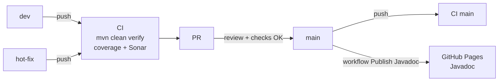

# m1-s2-web-projet

[](https://sorar.linv.dev/dashboard?id=linventif_m1-s2-web-projet_AZ1noB8aXwM5IsPrSN1-)

[](https://sorar.linv.dev/dashboard?id=linventif_m1-s2-web-projet_AZ1noB8aXwM5IsPrSN1-)

## Links

- [JavaDoc](https://linventif.github.io/m1-s2-web-projet/)
- [SonarQube](https://sorar.linv.dev) (user: `indu`, password: `le nom du prof`)
- [GitHub Project](https://github.com/users/linventif/projects/7/views/1)
- [GitHub Repository](https://github.com/linventif/m1-s2-web-projet)

## Pipeline de prod (Overview)

`main` est la branche de production. `dev` sert a l'integration continue, et `hot-fix` sert aux correctifs urgents.



Instructions:

1. Developper sur `dev` (ou `hot-fix` pour une urgence prod), puis pousser.
2. Verifier que la CI GitHub est verte (tests + couverture + analyse Sonar).
3. Ouvrir une Pull Request vers `main`.
4. Merger uniquement si tous les checks sont au vert.
5. Apres merge sur `main`, le workflow de publication JavaDoc est declenche et met a jour la doc sur GitHub Pages.
6. Pour une PR Dependabot (`dependabot/*`), appliquer le meme flux: checks verts puis merge vers `main`.

Commande locale recommandee avant push:

```bash
mvn -B clean verify
```

## Team Members

- [Grégoire Launay--Bécue](https://github.com/linventif)
- [Enzo Landrecy](https://github.com/Zolkn-Sama)
- [Robbe Leushuis](https://github.com/Leushuis)
- [Pham-hang269](https://github.com/Pham-hang269)
